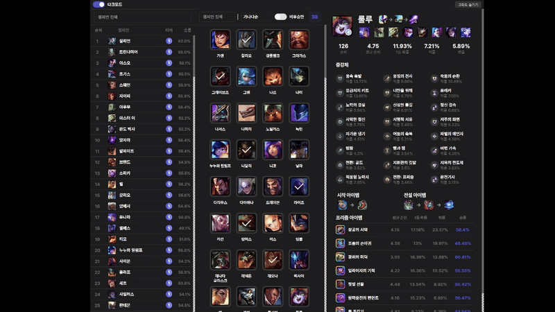

# 🎮 ArenaGod

<div align="center">
  
  
  [한국어](README.md) | [English](README_EN.md)

  [](https://opensource.org/licenses/MIT)
  
  
  [](https://github.com/jungyuminn/ArenaGod/issues)
</div>

리그 오브 레전드 아레나 모드를 위한 챔피언 가이드 및 통계 추적 데스크톱 애플리케이션입니다.

## ✨ 주요 기능

### 📊 챔피언 랭킹 (좌측)


- 챔피언별 아레나 모드 랭킹 실시간 표시
- 초성 검색 및 띄어쓰기 무시 검색 지원
- 클릭 시 해당 챔피언의 상세 통계로 이동
- 티어별 색상 구분으로 한눈에 보는 챔피언 성능

### 🎯 챔피언 그리드 (중앙)


- 좌클릭으로 챔피언 상세 통계 확인
- 우클릭으로 우승 체크/해제
- 상단에 우승 챔피언 수 표시
- 우승 체크 상태 전체 화면 연동

#### 고급 필터링


- 다양한 정렬 옵션
  - 가나다순
  - 우승한 챔피언 순
  - 우승하지 않은 챔피언 순
- '비우승만' 스위치로 빠른 필터링
- 검색, 필터, 스위치 조합 가능

#### 유연한 레이아웃


- 창 크기에 따른 자동 그리드 열 조정
- 그리드 보이기/숨기기 지원


### 📝 챔피언 상세 정보 (우측)


- 챔피언 기본 정보
  - 픽률, 승률, 티어 정보
  - 좌클릭으로 우승 체크/해제
- 시너지 챔피언 추천
  - 상위 8개 시너지 챔피언 표시
  - 클릭 시 해당 챔피언 통계로 이동
- 증강체 추천
  - 실버/골드/프리즈매틱 티어별 분류
  - 증강체 상세 정보 및 설명
- 아이템 빌드 가이드
  - 시작 아이템 추천
  - 핵심 아이템 빌드
  - 프리즈매틱 아이템 옵션

### 🎨 사용자 경험


- 다크 모드 지원
- 반응형 레이아웃
- 직관적인 UI/UX
- 실시간 데이터 연동

## 🚀 설치 및 실행

1. 저장소 클론
```bash
git clone https://github.com/jungyuminn/ArenaGod.git
cd ArenaGod
```

2. 필요한 패키지 설치
```bash
pip install -r requirements.txt
```

3. 애플리케이션 실행
```bash
python src/main.py
```

## 🔨 빌드

Windows 실행 파일 생성:
```bash
pyinstaller ArenaGod.spec
```

## 🛠️ 기술 스택

- Python 3.9+ 🐍
- PyQt6 🎨
- Qt Designer 🎯
- PyInstaller 📦

## 🤝 기여

버그 리포트나 새로운 기능 제안은 GitHub Issues를 통해 제출해주세요.

## 📄 라이선스

이 프로젝트는 MIT 라이선스를 따릅니다.