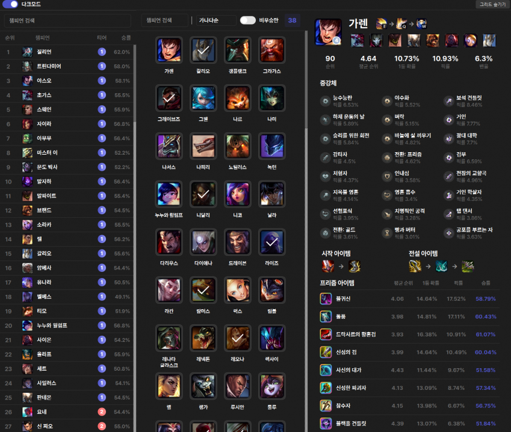
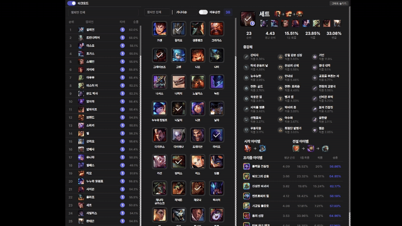
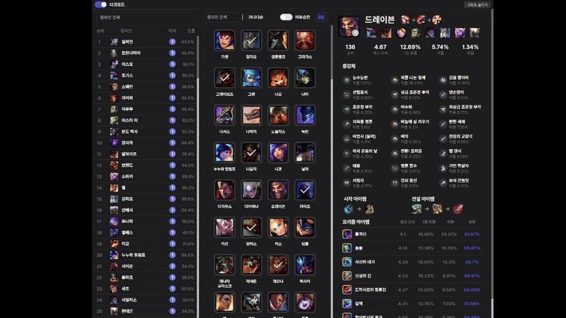
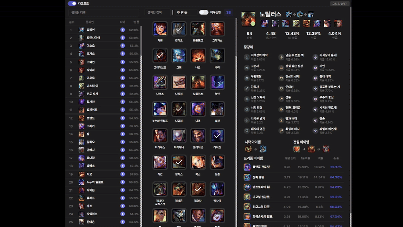
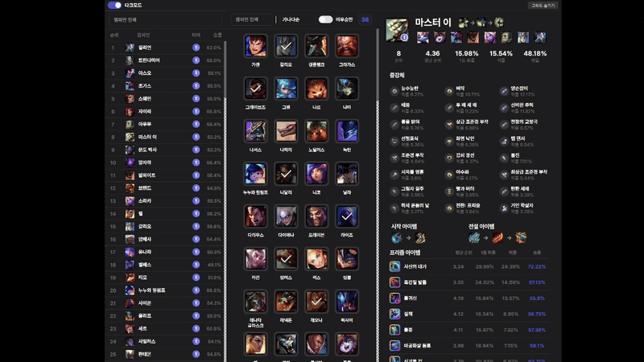

# 🎮 ArenaGod

<div align="center">
  <a href="README.md">한국어</a> | <a href="README_EN.md">English</a>

  [](https://opensource.org/licenses/MIT)
  
  
  [](https://github.com/jungyuminn/ArenaGod/issues)
</div>

<div align="center">
  
</div>

A desktop application for managing champion statistics and victory records in League of Legends Arena Mode.

## ✨ Features

### 📊 Champion Rankings (Left)


- Real-time Arena Mode champion rankings
- Smart search with Korean initial consonants
- Click to view detailed champion statistics
- Color-coded tiers for quick performance assessment

### 🎯 Champion Grid (Center)


- Left-click for detailed champion statistics
- Right-click to toggle victory status
- Victory counter at the top
- Synchronized victory status across views

#### Advanced Filtering


- Multiple sorting options
  - Alphabetical order
  - Victory count
  - Non-victory count
- Quick 'Non-winners only' toggle
- Combinable search, filter, and toggle options

#### Flexible Layout


- Responsive grid column adjustment
- Grid show/hide functionality


### 📝 Champion Details (Right)


- Champion Basic Information
  - Pick rate, win rate, tier data
  - Left-click to toggle victory status
- Synergy Champion Recommendations
  - Top 8 synergistic champions
  - Click to view their statistics
- Augment Recommendations
  - Silver/Gold/Prismatic tier categorization
  - Detailed augment information
- Item Build Guides
  - Starting item recommendations
  - Core item builds
  - Prismatic item options

### 🎨 User Experience

- Dark mode support
- Responsive layout
- Intuitive UI/UX
- Real-time data synchronization

## 🚀 Installation & Usage

1. Clone the repository
```bash
git clone https://github.com/jungyuminn/ArenaGod.git
cd ArenaGod
```

2. Install required packages
```bash
pip install -r requirements.txt
```

3. Run the application
```bash
python src/main.py
```

## 🔨 Build

Generate Windows executable:
```bash
pyinstaller ArenaGod.spec
```

## 🛠️ Tech Stack

- Python 3.9+ 🐍
- PyQt6 🎨
- Qt Designer 🎯
- PyInstaller 📦

## 🤝 Contributing

Please submit bug reports and feature suggestions through GitHub Issues.

## 📄 License

This project is licensed under the MIT License.